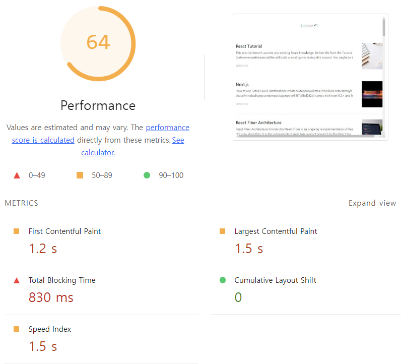
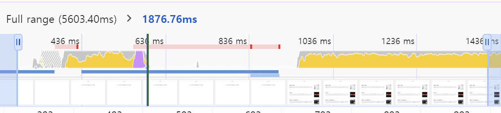
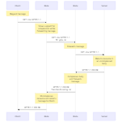

# 1장 블로그 서비스 최적화

### 이 장에서 최적화 기법
- 이미지 사이즈 최적화
  > 이미지를 적정한 사이즈로 사용해야 한다. 너무 작으면 화질 저하, 너무 크면 네트워크 트래픽의 증가로 로딩속도가 느려짐. 
- 코드 분할
  > SPA의 특성상 모든 리액트 코드는 하나의 js로 번들링 되므로 쓰지 않는 코드도 첫 로딩 시에 포함되어 무거워짐. 따라서 당장 필요없는 코드는 스플리팅하여 필요 시점에 쓰도록 분할. 
- 텍스트 압축
  > 웹페이지 접속 시 다양한 리소스(HTML, CSS, js 등)을 받는데 서버에서 미리 압축이 가능함. 압축 시 본 사이즈보다 작은 사이즈로 다운로드 할 수 있어서 웹페이지 로드가 빨라짐.
- 병목 코드 최적화 
  > 특정 js 코드 때문에 서비스가 느리게 다운되거나 실행되는 경우가 있음. 이런 현상을 만드는 코드를 '병목 코드' 라고 함. 이 병목코드를 최적화 해보자.

### 예제 프로젝트 안 열리는 오류
> `npm run start` 해보았으나 열리지 않음
-  node 버전 호환 문제로 node 16버전으로 다운그레이드 해주어야 함.
-  `nvm` 을 사용하여 노드버전을 변경 해주었다. 
    > `nvm` 은 node version manager로 node.js의 도구다. 개발환경에 여러 개의 node 버전을 설치해 상황에 따라 node.js 버전을 변경해가며 사용 할 수 있게 해준다.
- nvm 사용방법
  - nvm 설치 : https://github.com/coreybutler/nvm-windows/releases 에서 `nvm-setup-zip` 다운 
  - `nvm install 16` 으로 node 버전 설치
  - `nvm ls` 로 사용 가능 버전 확인
  - `nvm use 16` 으로 버전 체인지
  - `node -v` 으로 16버전인지 확인

### Lighthouse 검사
- Mode
  - `Navigation` 기본 값으로, 초기 페이지 로딩 시 발생하는 성능 문제를 분석
  - `Timespan` 사용자가 정의한 시간 동안 발생한 성능 문제를 분석
  - `Snapshot` 현재 상태의 성능 문제를 분석
- Categories
  - `Performance`: 웹페이지의 로딩 과정에서 발생하는 성능 문제를 분석
  - `Accessibility`: 서비스의 사용자 접근성 문제를 분석
  - `Best Practices`: 웹사이트의 보안 측면과 웹 개발의 최신 표준에 중점을 두고 분석
  - `SEO`: 검색 엔진에서 얼마나 잘 크롤링되고 검색 결과에 표시되는지 분석
  - `Progressive Web App`: 서비스워커와 오프라인 동작 등, PWA와 관련된 문제를 분석. 

### 웹 바이탈 분석

1. First Contentful Paint
   > 페이지가 로드될 때 브라우저가 DOM 콘텐츠의 첫 번째 부분을 렌더링하는 데 걸리는 시간. 총점의 10% 가중치를 가짐.
2. Largest Contentful Paint
   > 페이지가 로드될 때 화면 내에 있는 가장 큰 이미지나 텍스트 요소가 렌더링되기까지 걸린 시간. 가중치 25%를 가짐.
3. Total Blocking Time
   > 페이지가 클릭, 입력 등 사용자와 상호작용에 응답하지 않도록 차단된 시간의 총합. 이는 FCP와 TTI 사이 시간 동안 일어남. 메인 스레들르 독점해 다른 동작을 방해하는 작업에 걸린 시간을 총합. 가중치 30% 
4. Cumulative Layout Shift
   > 페이지 로드 과정에서 발생하는 예기치 못한 레이아웃 이동을 측정. 레이아웃 이동은 화면 상에서 요소의 위치나 크기가 순간적으로 변하는 것. 15% 가중치.   
5. Speed Index 
   > 페이지 로드 중 콘텐츠가 시각적으로 표시되는 속도. (skeleton을 적용하면 더 높은 점수 일 수 있다.) 가중치 10%

- 모바일 환경은 비교적 더 느리다. 

### 이미지 최적화 
- Diagnotics 항목을 보면 `Properly size images` 를 볼 수 있다.
    
- 항목에 어떤 이미지가 적절하지 않은 사이즈인지 보여준다. 
- 전체 이미지에 대해 최적화 시 약 3,241.9KiB를 절약할 수 있다. 
- 1 KiB는 2^10 byte로 1024byts. KB는 10^3 = 1,000bytes. 
  
  
- 실제 이미지 사이즈인 Intrinsic size는 1200 * 1200 px이나 렌더 사이즈는 120 * 120px이다.
- 따라서 사이즈를 더 줄여도 된다. 요즘은 같은 공간에 더 많은 픽셀을 그릴 수 있기 때문에 120px의 두 배인 240 * 240px이 적절하다. 
- 이 이미지들은 로컬 API 서버가 넘겨준 데이터이다. Network탭 > articles> Preview에서 데이터 형식을 보면 `unsplash.com` 에서 받아오는 이미지임을 확인할 수 있다.
- 정적 이미지라면 자르면 되지만 API를 통해 받아오는 것은 `Cloudinary`나 `Imgix` 같은 이미지 CDN을 사용해 최적화 한다. 

### 이미지 CDN 
> CDN(Content Delivery Network)는 물리적 거리의 한계를 극복하기 위해 사용자와 가까운 곳에 콘텐츠 서버를 두는 기술이다. 서버에 있는 리소스를 사용자와 가까운 서버에 캐싱해두어 다운로드 시간을 단축시키는 것.

> 이미지 CDN은 이미지에 튻화된 CDN으로 '__CDN 기능 + 이미지를 특정 형태로 가공해 전달해주는 기능'__ 이 있다.

- `http://cdn.image.com?src=[img src]&width=240&height=240` 이미지 cdn 서버의 주소에 쿼리스트링으로 가져올 이미지 주소, 원하는 형태를 명시해줄 수 있다.
- 위 방법도 있고, imgix와 같은 cdn 솔루션도 있다. 이 예제에서는 unsplash가 이미지 cdn역할을 하고 있다.
- getParametersForUnsplash 함수로 전달되는 width와 height를 수정해서 최적화

**변경후**

- TBT, SI, LCP등 점수가 많이 상향됨
  
### 병목 코드 최적화 

- javascript execution time: JS 파싱, 컴파일 및 실행에 소요되는 시간을 줄여보자. 더 작은 JS 페이로드를 제공해 문제를 해결하자. 
- `js/1.chunk.js`를 확인해보면 939ms동안 실행된다. 
- Performance 패널을 통해 메인 스레드 작업을 상세히 살펴보아 왜 그랬는지 알아보자
- Performance> 새로고침 아이콘(ctrl+shift+E). 


1. CPU 차트: 시간에 따라 CPU가 어떤 작업에 리소스를 사용하고 있는지 비율로 보여줌. 
   - 자바스크립트=노랑/ 렌더링,레이아웃=보라/ 페인팅=초록/ 기타 시스템= 회색
   - 빨간색 선은 병목 발생 지점. 
2. Network 차트
   - CPU 밑에 막대 형태로 표기. 위쪽에 진한 막대는 우선순위가 높은 네트워크 리소스 
   - 왼쪽 회색선: 초기 연결 시간
   - 막대의 옅은 색: 요청을 보낸 시점부터 응답을 기다리는 시점까지 시간 (TTFB)
   - 막대의 짙은 색: 콘텐츠 다운로드 시간
   - 오른쪽 회색선: 해당 요청에 대한 메인 스레드의 작업 시간 
3. Framee: 화면의 변화가 있을 때마다 스크린샷을 찍어줌
4. Timings: 리액트에서 각 컴포넌트의 렌더링 시간을 측정함. 
5. Main: 브라우저의 메인 스레드에서 실행되는 작업을 플레임 차트로 보여줌
6. 하단 
   - Summary: 선택 영역에서 발생한 작업 시간의 총합과 각 작업이 차지하는 비중
   - Bottom-up: 가장 최하위에 있는 작업부터 상위 작업까지 역순으로 보여줌
   - Call-tree: 가장 상위 작업부터 하위 작업 순으로 작업 내용을 트리뷰로 보여줌 
   - Event log: 발생한 이빈트를 보여줌. Loading, Experience Scripting, Rendering, Painting
  
> 빨간 막대로 표시된 부분의 Main과 Timings를 확인하여 어디서 병목이 발생하는지 확인한다. 하단으로 내려가면 어떤 작업이 오래걸리는지 디테일하게 확인이 가능하고, 그 부분에서 성능적으로 개선할 수 있는 점을 찾는다.


### 코드분할& 지연로딩
> 화면을 그리는데 필요한 리액트 코드 다운이 늦어지면 페인트 시간이 늦어진다. 웹팩을 통해 번들링된 파일을 분석하고 최적화하여 자바스크립트 파일이 빨리 뜰 수 있도록 해보자

- Webpack Bundle Analyzer라는 툴을 이용해 청크 파일 구성을 상세히 보자.
- CRA의 경우 npm run eject로 설정 파일 추출 후 웹팩 설정을 만져야 하는데 까다로움
- 따라서 `cra-bundle-analyzer` 를 사용함. CRA에서 eject없이 `webpack-bundle-analyzer` 사용을 가능하게 함
- `npm install --save-dev cra-bundle-analyzer`
- `npx cra-bundle-analyzer` 
- build 폴더 안에 report.html을 열어준다.
- 파일의 실제 크기에 따라 비율로 보여줌, 어떤 패키지가 어느 정도의 용량을 차지하는지 알 수 있다.
- 
- 
  - `chunck.js` 가 가장 큰 부분을 차지하고 있다. 하위 모듈이 node_modules로 npm을 통해 설치된 외부 라이브러리임.
  - `main.chunck.js` 는 서비스에서 작성된 코드

__코드분할 해보기__


- 사진처럼 `package-lock.json`을 보면 패키지에 대한 의존성을 가진 패키지 확인을 할 수 있다.
- `npm install`을 하면 이 `package-lock.json` 을 참조해 설치하고자 하는 패키지가 어떤 버전의 패키지에 의존하는 지 확인해 함께 설치한다.
- `refractor`는 `react-syntax-highlighter` 패키지에 참조되는데 이는 마크다운 코드 블록 스타일을 입히는데 사용되는 라이브러리다
- 이는 블로그 상세페이지에서만 쓰이는 라이브러리로 첫 렌더링 때 필요없는 요소다.
  
> __코드분할__ 이란? 하나의 번들 파일을 여러 개의 파일로 쪼개는 방법으로 쪼개진 코드는 사용자가 해당 코드가 필요할 때 로드되어 실행되게 한다. 이를 지연 로딩이라 한다.

- 코드 분할 기법에는 여러 패턴이 있다. *페이지 별 코드 분할*, 각 페이지가 공통으로 쓰는 모듈이 많고 그 사이즈가 크다면 *모듈별로 분할*하기도 한다.
  
- 동적 import를 활용해 해당 모듈을 런타임에 로드하도록 하기 
- webpack은 동적import 구문을 만나면 코드를 분할하여 번들링한다. 
- 문제는 Promise형태로 모듈을 반환하므로 Promise 내부에 로드된 컴포넌트를 promise 밖으로 꺼내줘야 한다.
- 이를 리액트에서 제공하는 `lazy`와 `Suspense`로 해결할 수 있다.
- lazy는 동적 import를 호출해 그 결과인 Promise를 반환하는 함수를 인자로 받는다.
- Suspense는 동적 import하는 동안 fallback prop에 정의된 내용을 렌더링하고, 이후 컴포넌트가 온전히 로드되면 렌더링시킨다. 

```javascript
import React, {Suspense} from 'react'

const SomeComponenet = React.lazy(()=> import('./SomeComponent'))
function MyComponent(){
    return(
      <div>
        <Suspense fallback={<div>loading</div>}>
          </SomeComponent>
        </Suspense>
      </>
    )
}
```

분할 결과 

- 0.chunk.js: ListPage에서 사용하는 외부 패키지를 모아둔 번들
- 3.chunck.js: ViewPage에서 사용하는 외부 패키지를 모아둔 번들
- 4.chunck.js: 리액트 공통 패키지를 모아 둔 번들 
- 5.chunck.js: ListPage 컴포넌트 번들 파일
- 6.chunck.js: ViewPage 컴포넌트 번들 파일 


### 텍스트 압축
> cra는 production환경과 development환경에 차이가 있다. 예를 들어, production 환경일 때는 webpack에서 경량화나 난독화 같은 추가적인 최적화 작업을 한다. 반면 development환경엔 그런 최적화 작업 없이 서비스를 실행한다. 즉, 최종 서비스의 성능을 측정할 때는 실제 제공되는 `production` 환경으로 빌드된 서비스의 성능을 측정해야한다. 

- `npm run serve` 를 통해 빌드 > 빌드 완료 시 serve 라이브러리를 통해 build 폴더 안 파일을 서비스함 
- development환경과 다른 점은 빌드 시 경량화 같은 최적화 작업으로 chunck 파일이 더 작다.

현재 상세페이지를 lighthouse로 돌리면 점수가 낮게 나온다. 
  

왜냐하면 분할했던 패키지가 번들 파일에 포함되어 있고 블로그 글 내용이 모두 들어있어 메인페이지에 낮을 수 있다.
  


- Enable text compression: 서버로부터 리소스를 받을 때, 텍스트를 압축해 받아라. 
- Html, css, javascript 같은 텍스트 형태의 파일을 압축해 더 작은 크기로 빠르게 전송함
- 압축 파일은 사용하는 시점에 압축을 해제함.
- 텍스트 압축 여부는 HTTP 헤더를 확인하면 된다.
  
  
</br>

🚩HTTP에서의 압축(https://developer.mozilla.org/ko/docs/Web/HTTP/Compression)
> Compression is an important way to increase the performance of a website. For some documents, size reduction of up to 70% lowers the bandwidth capacity needs.

  압축은 3가지 단계에서 진행된다.
  1. 파일 형식 압축
   - `Lossy Compression(손실압축)`: 데이터 복구 시 일부 손실될 수 있으나 사용자에게 거의 느껴지지 않는다. 예: JPEG이미지, 웹 비디오 포맷
  - `Loss-less Compression(무손실 압축)`: 데이터를 복구할 때 원본 데이터가 그대로 유지된다. 예: GIF, PNG이미지
  2. 종단 간 압축
   - 서버에서 클라이언트로 전송되는 HTTP 메시지 본문을 압축해 전송
   - 브라우저와 서버는 `Accept-Encoding` 헤더를 통해 사용할 압축 알고리즘을 정함. 가장 일반적으로 사용되는 알고리즘은 `gzip`과 `br`
   - 모든 최신 브라우저와 서버는 이를 지원하며, 압축된 파일은 `Content-Encoding` 헤더를 통해 표시됨
    
    
  3. Hop-by-Hop 압축
   - 클라이언트와 서버 간의 중간 노드 간에 데이터를 압축
   - `Transfer-Encoding` 헤더를 사용해 노드 간 전송 시 압축을 지정함. 이 방식은 드물게 사용됨 
   - 성능 향상을 위해 활성화하는 것이 좋으며, 이미 압축된 파일(이미지, 오디오, 비디오 등)에는 적용하지 않는다. 
    
  

### 텍스트 압축 적용
텍스트 압축은 이 리소스를 제공하는 서버에서 설정해야 한다. 이 서비스의 서버는 `serve` 라이브러리로 `package.json`을 확인하면 script에 다음과 같이 작성되어 있다.

`"serve": "npm run build && node ./node_modules/serve/bin/serve.js -u -s build",` 
- `npx serve --help`를 처보면 serve의 옵션에 대한 설명이 나온다.
- -u 옵션은 no-compression, -s옵션은 SPA 서비스를 위해 매칭되지 않는 주소는 모두 index.html로 보내겠다는 옵션.
- 따라서 -u 옵션을 제거해준다.
- 실제 서버에 적용하려면 직접 텍스트 압축 설정을 해야 한다. 단일 서버가 아닌 여러 서버를 사용한다면 Nginx같은 게이트웨이 서버에 공통적으로 텍스트 압축을 적용할 수 있다.