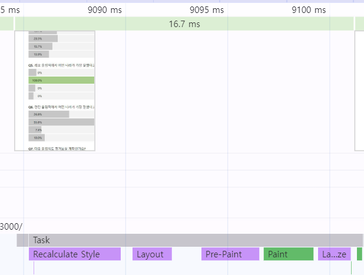
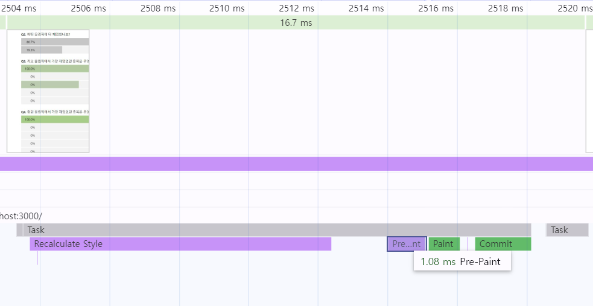

# 2장 올림픽 통계 서비스 최적화

### 이 장에서 배울 최적화 기법

- **CSS 애니메이션 최적화**
- **컴포넌트 지연로딩**: 단일 컴포넌트를 분할해 컴포넌트가 쓰이는 순간에 불러오게 만들기
- **컴포넌트 사전로딩**: 지연로딩은 서비스 이용 과정에서 추가 다운로드하는 시간만큼 서비스 이용에 지연을 발생시킴. 이를 개선하고자 해당 코드가 필요한 시점보다 미리 코드를 로드하여 지연없이 사용하도록 하기
- **이미지 사전로딩**: 이미지를 필요한 시점보다 사전에 다운

<br>

## 1. 애니메이션 최적화

- 컴퓨터 성능이 좋다면 performance에서 CPU 설정을 `6x slowdown` 으로 설정하면 애니메이션 끊김 현상을 확인해볼 수 있다
- 이런 끊김 현상을 `Jank` 라고 한다.
  ```javascript
  const BarGraph = styled.div`
    position: absolute;
    left: 0;
    top: 0;
    width: ${({ width }) => width}%;
    transition: width 1.5s ease;
    height: 100%;
    background: ${({ isSelected }) =>
      isSelected ? 'rgba(126, 198, 81, 0.7)' : 'rgb(198, 198, 198)'};
    z-index: 1;
  `;
  ```
- 쟁크 현상은 transition이 적용된 width 속성 때문이다

### 애니메이션 원리

- 일반적으로 디스플레이의 주사율은 60Hz 즉 1초에 60장의 정지된 화면을 빠르게 보여준다
- 따라서 브라우저도 이에 맞춰 최대 60FPS(Frames Per Second)로 1초에 60장의 화면을 새로 그린다
- 쟁크 현상은 브라우저가 정상적으로 60FPS를 그리지 못했기 때문이다

### 브라우저 렌더링 과정

](image.png) -출처 https://velog.io/@xmun74/%EB%B8%8C%EB%9D%BC%EC%9A%B0%EC%A0%80-%EB%A0%8C%EB%8D%94%EB%A7%81-ntmiyha4

- 이러한 경로를 `Critical Rendering Path` 또는 `Pixel Pipeline`이라고 한다
- DOM+CSSOM
  - 처음에 HTML, CSS 등 필요한 리소스를 다운 받고 HTML은 브라우저가 이해할 수 있는 형태로 파싱한다
  - 그렇게 요소간 관계가 트리로 표현된 DOM을 만든다
  - CSS도 브라우저가 이해할 수 있는 CSSOM 트리를 만든다
- RenderTree
  - DOM과 CSSOM의 결합으로 생성
  - 화면에 표시되는 각 요소의 레이아웃을 계산하는 데 사용됨
  - `display:none` 은 렌더 트리에 포함되지 않지만, `opacity:0` 이나 `visibility:hidden` 요소는 렌더 트리에 포함됨
- 레이아웃
  - 렌더 트리 완성 후 화면 구성요소의 위치나 크기를 계산 후 배치하는 레이아웃 단계로 간다
- 페인트
  - 화면에 배치된 요소에 색을 채워넣는다
  - 배경색을 채우거나 글자 색을 결정하거나 테두리 색 변경 등등
  - 브라우저는 효율적인 페인트 과정을 위해 구성 요소를 여러 개의 레이어로 나눠서 작업하기도 함
- 컴포지트(composite)
  - 각 레이어를 하나로 합성하는 과정
- 📌리플로우와 리페인트

  - 첫 화면이 모두 그려진 후, 자바스크립트로 화면 내 어떤 요소의 너비와 높이 변경되었다면 이를 다시 계산해 화면을 새로 그린다
  - **리플로우**는 주요 렌더링 경로의 모든 단계를 재실행 -> 브라우저 리소스 많이 사용
  - **리페인트**는 DOM+CSSOM 새로 생성-> 렌더트리 -> 페인트-> 컴포지트로 레이아웃 단계를 건너뛰어 리플로우보단 빠르다

    - 리플로우와 리페인트를 발생시키는 속성

      > 리플로우: position, display, width, float, height, font-family, top, left, font-size, font-weight, line-height, min-height, margin, padding, border

      > 리페인트: background, background-image, background-position, border-radius, border-style, box-shadow, color, outline 등

- 리페인트나 리플로우는 리소스를 많이 먹기 때문에 결국 화면 리렌더링을 느리게 한다. 이걸 피하기 위해 `transform, opacity` 같은 속성을 사용한다
- 이런 속성은 해당 요소를 별도의 레이어로 분리하고 작업을 GPU에 위임해 처리하여 레이아웃 단계와 페인트 단계를 건너 뛸 수 있습니다

### 하드웨어 가속(GPU 가속)

- CPU가 처리할 작업을 GPU에 위임해 더욱 효율적으로 처리
- 하드웨어 가속을 사용하려면 GPU에 의해 처리되어 레이아웃 단계와 페인트 단계 없이 화면상의 요소의 스타일을 변경할 수 있다.

> `transform: translate()` 는 처음부터 레이어를 분리하지 않고 변화가 일어난 순간 레이어를 분리한다. 반면 `transform:translate3d()` 또는 `scale3d()` 같은 3d 속석들 또는 `will-change` 속성은 처음부터 레이어를 분리하여 변화에 더욱 빠르게 대처한다. 하지만 레이어가 너무 많으면 그만큼 메모리를 많이 사용해 주의해야 한다

- 현재: width를 변경하여 애니메이션 효과를 줬는데 이는 width가 변할 때마다 리플로우가 발생하고, 브라우저가 아주 짧은 순간마다 화면을 갱신해야 하며 모든 단계를 제시간에 처리못하는 **쟁크** 현상이 발생한다.
- 변경

  ```css
  //...생략
  //   width: ${({ width }) => width}%; -> 변경 전
  width: 100%;
  transform: scaleX($ {({width}) => width / 100});
  transform-origin: center left;
  transition: width 1.5s ease;
  ```

- scaleX 안 width는 퍼센트 값으로 scaleX 함수의 인자로 쓰이도록 1 이하의 ㅣㄹ수 값으로 바꾼다.
- scaleX에 의해 막대의 너비가 0으로 줄고, width값이 100이면 scaleX(1)이 되므로 width가 100%로 유지된다
- center left를 추가하여 scale의 기준점을 왼쪽으로 변경한다. scale은 기본적으로 중앙을 기준점으로 정렬된다.

  before
  

  after
  
